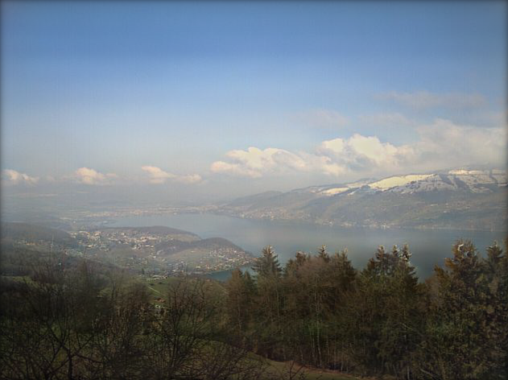
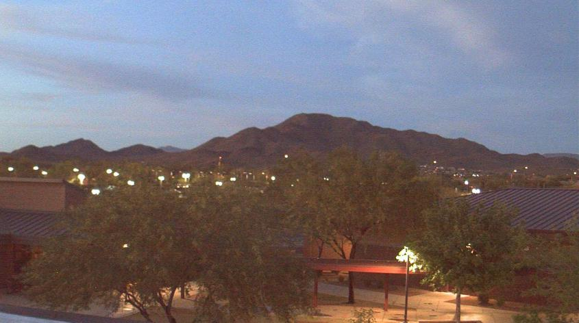
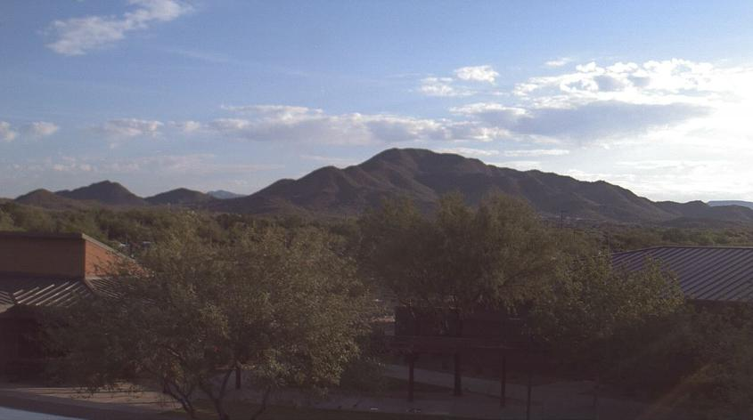
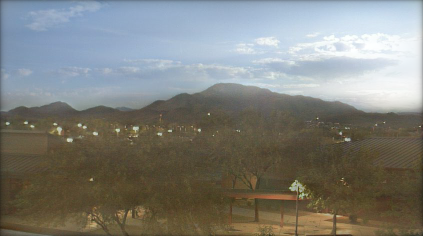

 

# Gaussian-Poisson-GANs-For-Image-Blending

This project implements an algorithm for **blending composite images**(copy-paste images/foreign objects in a scene) using a **Wasserstein Generative Adversarial Network(GAN)** and **the Gaussian-Poisson equation**<sup>[1]</sup>

# An overview of the algorithm

* The **GAN** is trained to give a very **low-resolution blend**(eg. 64 x 64), given the composite image.

* The **low-resolution image** is used as a **color constaint** in the **Gaussian-Poisson equation** proposed in [1]. **An optimization problem** is solved to **estimate the low-frequency signals**(i.e. using a Gaussian blur) of the **GAN's output** and to estimate the **high-frequency signals**(i.e. image gradient) of the **composite(copy-paste) image** using a **Laplacian pyramid**.

# Results

| Source Image    | Target Image           | Blend      |
|:---------------:|:----------------------:|:----------:|
||||
||||


# Instructions

<details>
<summary>
Installation
</summary>

To install, execute:

```
pip install -r requirements.txt
```

</details>

<details>
<summary>
Data
</summary>
  
[The Transient Attributes dataset](http://transattr.cs.brown.edu/files/aligned_images.tar) - 1.8 GB

Once it is downloaded, extract the .tar file. You will find a folder named _'imageAlignedLD'_ .

You can crop the images by executing the following command:

```
python crop_images.py --data_path path_to_imageAlignedLD_folder --output_dir path_to_output_folder
```
<br>
</details>
<details>

<summary>
Training
</summary>

The file _config.py_ contains various options and hyperparameters that can be set to train the GAN. Here are the default parameters:
``` 
'''DATA'''
CROPPED_SAMPLES_DIR = '../../../cropped_images'
NUM_TRAIN_SAMPLES = 100 
CENTER_SQUARE_RATIO = 0.5
SCALING_SIZE = 64
OUTPUT_SIZE = 64
TRAIN_BATCH_SIZE = 8 
TRAIN_SHUFFLE = False
TRAIN_NUM_WORKERS = 0
VAL_BATCH_SIZE = 8 
VAL_SHUFFLE = False
VAL_NUM_WORKERS = 0
VAL_RATIO = 0.1
NUM_VAL_SAMPLES = 64 

'''NET'''
NUM_ENCODER_FILTERS = 64
NUM_DECODER_FILTERS = 64
NUM_BOTTLENECK = 4000
NUM_OUTPUT_CHANNELS = 3

'''TRAINING'''
G_LR = 5e-4 
D_LR = 5e-4 
ADAM_BETA1 =0.5
NUM_EPOCHS = 15 
D_ITERS = 5
D_CLAMP_RANGE = [-0.01, 0.01]

'''TRAINING - LOGGING'''

PRINT_EVERY = 1 # gen_iter iterations 
LOGGING_K = 5
CHECKPOINT_DIR = 'experiments'
```
The parameters can be changed according to the requirements.

To train, the following command should be executed:

```
python train.py
```

If it is required to resume from a model checkpoint, the checkpoint can be passed to the train script using 

```
python train.py --checkpoint checkpoint_tar_path
```

</details>

<details>

<summary>
Inference
</summary>

For inference with a trained GAN, the following command can be executed:

```
python solve_gp_eqn.py 
```

The usage/options are as follows:

```

usage: solve_gp_eqn.py [-h] --src SRC --dest DEST --mask MASK --model MODEL
                       --output_dir OUTPUT_DIR [--use_composite USE_COMPOSITE]

Inference of Gaussian-Poisson GANs for Image Blending
 
arguments:
  -h, --help            show this help message and exit
  --src SRC             Source image path
  --dest DEST           Target image path
  --mask MASK           Mask image path
  --model MODEL         Trained model path
  --output_dir OUTPUT_DIR
                        Output directory
```

An example source, target and mask are given in the docs folder.

</details>

# Pretrained model

The pretrained model can be downloaded from [this google drive folder](https://drive.google.com/file/d/10eePae3qZEhlyoVFElpjRaHEfAOSYIXp/view?usp=sharing). The size of the model is **845 MB**. The model has been trained for **33 epochs**, and it took around **24 hours to train**.  

# Reference

The core algorithm was presented in the **ACMMM 2019 (oral) paper** titled

[1] **GP-GAN: Towards Realistic High-Resolution Image Blending**, 
    Huikai Wu, Shuai Zheng, Junge Zhang, Kaiqi Huang
    [[paper]](https://arxiv.org/pdf/1703.07195.pdf)

# Citation

Please cite the original paper if this code is useful for your research:

```
@inproceedings{wu2017gp,
  title     = {GP-GAN: Towards Realistic High-Resolution Image Blending},
  author    = {Wu, Huikai and Zheng, Shuai and Zhang, Junge and Huang, Kaiqi},
  booktitle = {ACMMM},
  year      = {2019}
}
```
